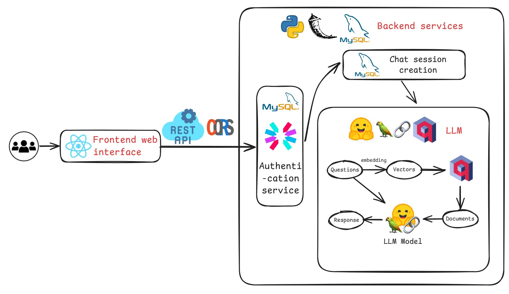
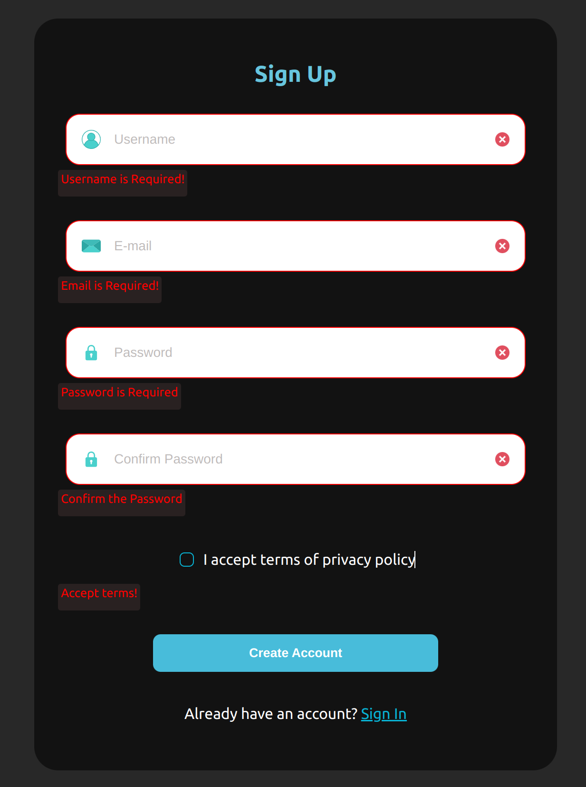
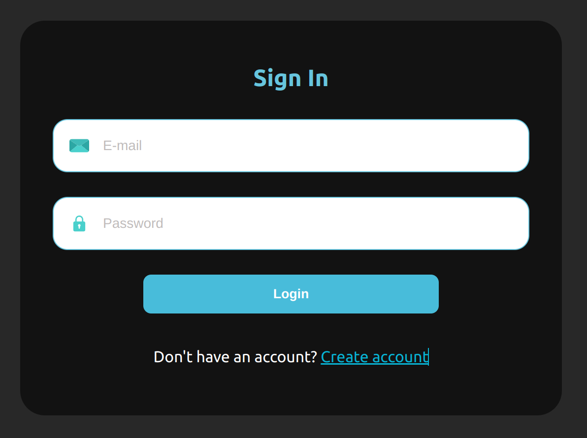
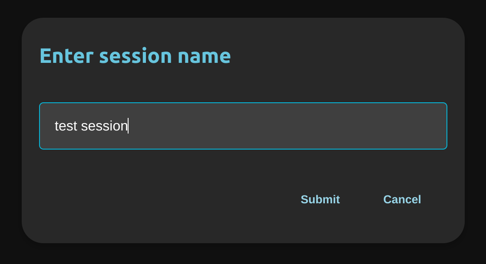
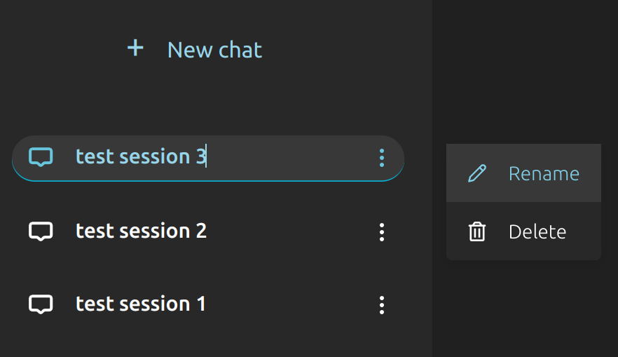
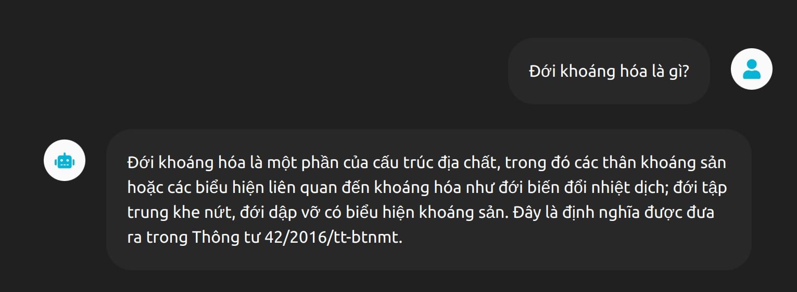
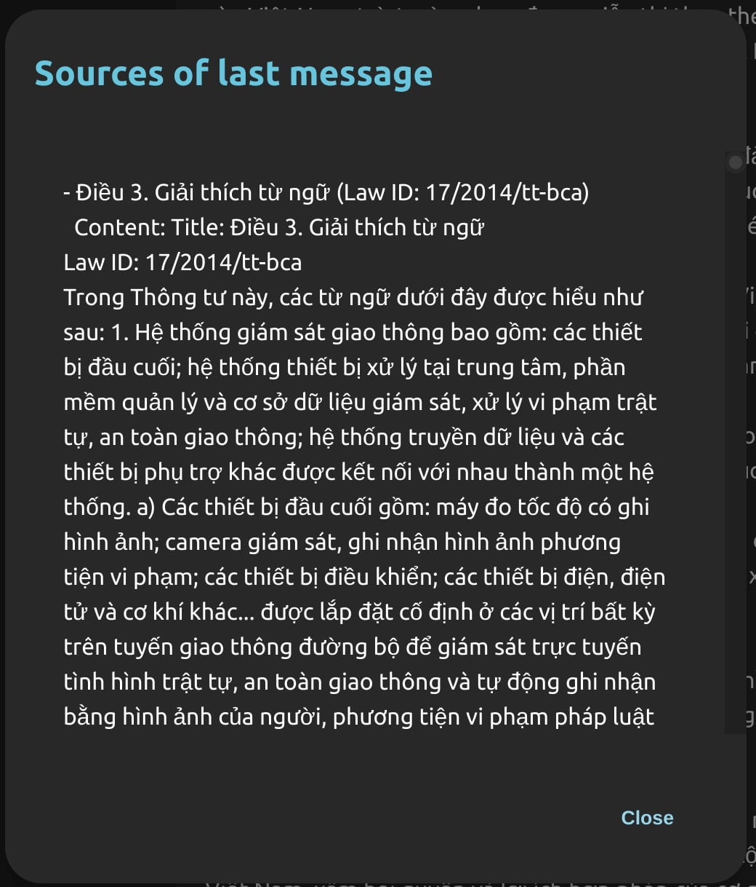

# CS311-project

This is a project built by [liuchangming88](https://github.com/liuchangming88) and [HTDKhoa](https://github.com/HTDKhoa)

## Table of Contents

- [Introduction](#introduction)
- [Project system architecture diagram](#system-architecture-diagram)
- [Main features](#main-features)
- [Setup](#setup)
- [Demo](#demo)

## Introduction

This project is an AI chatbot designed to provide law advising. It consists of a backend built with Python Flask, a frontend built with React.js, and a MySQL database.

The project uses a model with retrieval augmented generation. The embedding database are stored on qdrant using a private api key, and is trained privately, so if you want to clone and use this, you will have to use your own AI model for the chatbot.

## System architecture diagram



## Main features

### User management:

User registration and authentication are handled with logic like "email must be valid", "password must be at least 6 characters", "passwords do not match"...

### Chat session creation:
After authenticating, you will be redirected to the chat interface. At which, you can start creating chat sessions and start chatting with the chatbot.

There are basic session logics like renaming and deleting sessions.

### Chat
The model is a model from huggingface, called using API. It is then upgraded using retrieval augmented generation.

The data used for retrieval is Zalo AI Challenge 2021 - Legal Text Retrieval

### Source check
After each chat, you can click on the magnifying glass to get the sources that the chatbot retrieved to generate the message. You can use this message to verify the information given by the chatbot.

## Setup

The project uses a model with retrieval augmented generation. The embedding database are stored on qdrant using a private api key, and is trained privately, so if you want to clone and use this, you will have to use your own AI model for the chatbot.

This project has docker support.

First, you have to make sure git and docker are installed.

Run the following command:

Clone the repository and cd into it:

```bash
git clone https://github.com/LiuChangMing88/AI-chatbot-for-law-advising
cd AI-chatbot-for-law-advising
```

Create an `.env` file inside the `./backend` directory with the following values:

```plaintext
JWT_SECRET_KEY = Your JWT secret key
HUGGINGFACE_API_KEY = Your huggingface api key
QDRANT_API_KEY = Your qdrant api key
```

Run the docker-compose file to start the frontend on port 3000, backend on port 5000 and database on port 3306:
```bash
docker compose up --build
```

After the images are built, it still might take a while for docker to finish initializing the backend. You will know the backend are ready when you see it says "Running on all addresses (0.0.0.0)" in the CLI.

The application should be up and running. Access it on http://localhost:3000

## Demo:

### Registering:



### Logging in:



### Session creation:



### Session logics:



### Chatting:



### Sources check:

