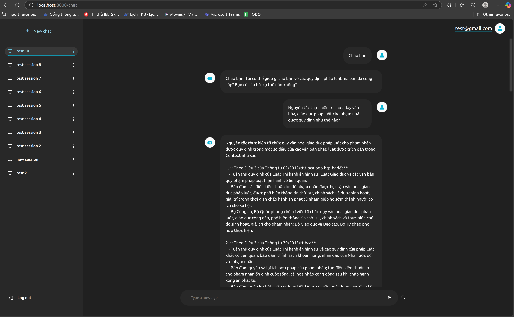

# CS311-project

This is a project built by [liuchangming88](https://github.com/liuchangming88) and [HTDKhoa](https://github.com/HTDKhoa).

## Table of Contents

- [Introduction](#introduction)
- [Project system architecture diagram](#system-architecture-diagram)
- [Main features](#main-features)
- [Setup](#setup)
- [Demo](#demo)

## Introduction

This project is an AI chatbot designed to provide law advising. The system structure can be divided into 3 main parts:
- Frontend: Developed using React.js.
- Backend: Built with Flask to handle the application logic, LangChain and Hugging Face for model implementation, and JWT for user authentication.
- Database: Includes MySQL for storing user credentials and chat data, and Qdrant for storing embedding vectors.

The project uses a model with retrieval augmented generation. The embedding database are stored on qdrant using a private api key, and is trained privately, so if you want to clone and use this, you will have to use your own AI model for the chatbot.

## System architecture diagram

<p align="center">
    
</p>

## Main features

### User management:

User registration and authentication are handled with logic like "email must be valid", "password must be at least 6 characters", "passwords do not match"...

The handling of authentication is done by JWT.

If the user's authentication is successful, the application generates a session token and stores it in the browser's local storage. 
To grant access to the chat section, the application verifies the presence of the token in the browser. 
The JWT token is decoded using the JWT secret key to extract the user's ID, which is then used to retrieve the appropriate chat sessions along with their corresponding chat history.

### Chat session creation:
After authenticating, you will be redirected to the chat interface. At which, you can start creating chat sessions and start chatting with the chatbot.

There are basic session logics like renaming and deleting sessions.

### Chat
The large language model used is [Qwen/Qwen2.5-Coder-32B-Instruct](https://huggingface.co/Qwen/Qwen2.5-Coder-32B-Instruct) from huggingface, called using API. 
It is then upgraded using retrieval augmented generation, with a database from Qdrant.

The process used to create the chat response can be simplified like this:
- First, the user sends a message.
- This message is embedded using embedding vectors 
(we use 2 embedding models: [truro7/vn-law-embedding](https://huggingface.co/truro7/vn-law-embedding) and [tranguyen/halong_embedding-legal-document-finetune](https://huggingface.co/tranguyen/halong_embedding-legal-document-finetune), both from huggingface).
- The embedded vectors are then used to retrieve documents from the Qdrant database, combined using RRF Fusion.
- The resulted documents will be fed into the large language model to generate a respond, and then displayed on the user's chat session.

The data used for retrieval is Zalo AI Challenge 2021 - Legal Text Retrieval.

### Source check
After each chat, you can click on the magnifying glass to get the sources that the system retrieved for the chatbot to generate the message
(which consist of: the titles of the laws and their corresponding content retrieved from Qdrant).

You can use these sources to verify the information given by the chatbot.

## Setup

The project uses a model with retrieval augmented generation. The embedding database are stored on qdrant using a private api key, and is trained privately, so if you want to clone and use this, you will have to use your own AI model for the chatbot.

This project has docker support.

First, you have to make sure git and docker are installed.

Run the following commands:

Clone the repository and cd into it:

```bash
git clone https://github.com/LiuChangMing88/AI-chatbot-for-law-advising
cd AI-chatbot-for-law-advising
```

Create an `.env` file inside the `./backend` directory with the following values:

```plaintext
JWT_SECRET_KEY = Your JWT secret key
HUGGINGFACE_API_KEY = Your huggingface api key
QDRANT_API_KEY = Your qdrant api key
```

Run the docker-compose file to start the frontend on port 3000, backend on port 5000 and database on port 3306:
```bash
docker compose up --build
```

After the images are built, it still might take a while for docker to finish initializing the backend. You will know the backend are ready when you see it says "Running on all addresses (0.0.0.0)" in the CLI.

The application should be up and running. Access it on http://localhost:3000.

## Demo:

### Overview of the application:

<p align="center">
    
</p>

### Registering:

<p align="center">
    
</p>

### Logging in:

<p align="center">
    
</p>

### Session creation:

<p align="center">
    
</p>

### Session logics:

<p align="center">
    
</p>

### Chatting:

<p align="center">
    
</p>

### Sources check:

<p align="center">
    
</p>